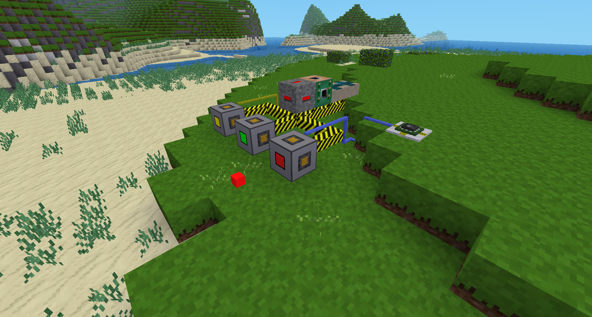
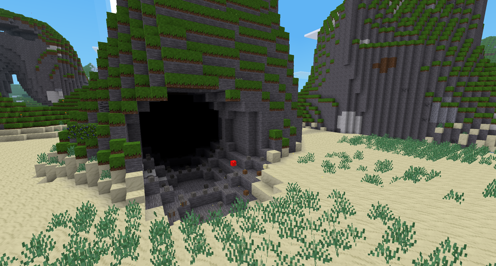
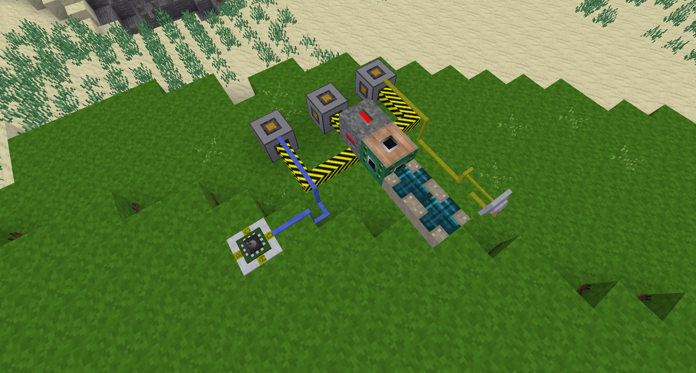

Spacecannon mod

[](https://content.minetest.net/packages/BuckarooBanzay/spacecannon/)

# Overview

Adds three scifi/space cannons with various projectile-speed and explosion-strength.
The cannons need HV-Power from a `technic` network and can be controlled via formspec/hand, mesecons or digilines.
They also need to charge first, which can take a couple of seconds depending on cannon-type.

The projectile detonates on impact but only in _non-protected_ areas!

# Screenshots






# Dependencies

Depends on:
* `technic`

Supports:
* `mesecons`
* `digilines`

# Mesecons

An "on" signal triggers a fire-action.

# Digilines

Fire a cannon:
```lua
if event.type == "program" then
 digiline_send("cannon", { command="fire", verbose=false })
end
```

Example response from a "get" request:
```lua
{
        type = "digiline",
        channel = "c7",
        msg = {
                HV_EU_input = 0,
                HV_EU_demand = 0,
                dir = {
                        y = 0,
                        x = 0,
                        z = 1
                },
                powerstorage = 10000,
                ready = true,
                origin = "c7",
                name = "spacecannon:cannon_green",
                pos = {
                        y = 10,
                        x = -64,
                        z = -53
                }
        }
}
```

The "fire" request can specify an optional "verbose" flag.  If this flag
evaluates to true, then the following example response will be sent back.
Note that if you have a large number of cannons that you will likely want
to disable responses.  N cannons firing and generating responses will
cause N^2 messages to be processed, as each cannon receives the fire response
from all of its peers.  If N>20, your LUAC will overheat.  N>900, and your
server admin will want to have a chat with you.

```lua
{
        type = "digiline",
        channel = "c2",
        msg = {
                pos = {
                        y = 10,
                        x = -59,
                        z = -53
                },
                origin = "c2",
                success = true
        }
}
```

# Api

Modify the ability to shoot depending on position or playername:
```lua
spacecannon.can_shoot = function(pos, playername)
	return true
end
```

# Contributors

* @BuckarooBanzay
* @dennisjenkins75

# License

Code: MIT
Textures: CC-BY-SA 3.0

# Attributions

* sounds/spacecannon_shoot.ogg https://freesound.org/people/jonccox/sounds/175261/
